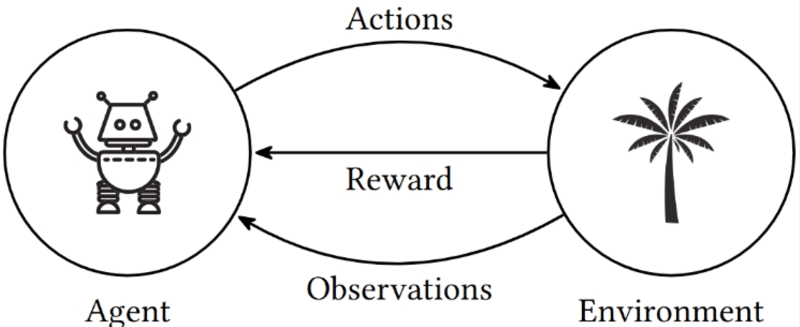

# Motivação

Uma criança brincando, não precisa de um professor, tem uma conexão sensorial-motor com o ambiente.
- Exploração produz informação sobre cause e efeito;
- Consequências do atos;
- **O que fazer** para **alcançar objetivos**.

Enquanto aprendemos (como humanos) estamos perceptivos a como o ambiente responde ao que fazemos e, com isso, tentamos influenciar o que acontece de acordo com nosso comportamento.

Vamos forcar em uma abordagem computacional de aprendizado através da interação. Não há um professor que diz o que é certo ou errado (aprendizado supervisionado) e não há, obrigatoriamente, interesse em descobrimento de padrões (aprendizado não supervisionado),

> (Lapan) RL is the third camp and lies somewhere in between full supervision and a complete lack of predefined labels. On the one hand, it uses many well-established methods of supervised learning, such as deep neural networks for function approximation, stochastic gradient descent, and backpropagation, to learn data representation. On the other hand, it usually applies them in a different way.

Vamos extrapolar a modelagem clássica da IA na qual agentes, dotados de sensores e atuadores, interagem com o ambiente.
Nossa abordagem computacional é um aprendizado orientado a objetivo aprendendo da interação. Precisamos de um novo sinal, além das observações.

# Uma definição formal

> Definição (Sutton): Reinforcement learning is learning what to do so as to maximize a numerical reward signal.

O que fazer: como mapear situações para ações
- situações: estado do mundo modelado. $x \in X$
- ações: de um conjuto de ações possíveis. $a \in A$
- mapa: pode ser funções, tabelas, políticas, que levam de $X$ para $A$, ou seja
$$ \pi (x) = a $$

A aplicação da ação $a$ vai alterar o estado do ambiente $x$ e com isso fornecer um sinal de recompensa $V(a,x) = r$, com $r \in \mathbb{R}$ (geralmente é uma estimativa, pois não sabemos o futuro).

$$ \pi (x) = a \quad | \quad \arg \max_{a \in A} V(x,a)$$

💡Para tornar mais interess  ante: Ações podem não afetar apenas a recompensa imediata, mas também a próxima situação (em recompensas subsequentes) ou apresentar um atraso na recompensa (_delayed reward_).

# A natureza do aprendizado por reforço

💡A dimensão $t$, às vezes não é considerada, explicitamente, em outro problemas de aprendizado de máquina. No aprendizado por reforço, ele faz parte da própria natureza.

- Em comparação a aprendizado supervisionado: Deve trabalhar em torno da própria experiência
- Em comparação a aprendizado não-supervisionado: Maximizar uma recompensa pode não ser necessariamente encontrar uma estrutura desconhecida

- Exploitation: Preferir ações **passadas** efetivas, em cima da recompensa.
- Exploration: Descobrir novas ações.

- A tarefa de RL é estocástica: Ações são tentadas várias vezes. Tentamos montar uma estimativa confiável da recompensa estimada.

# Explorando melhor os elementos de RL

- **Política**: A **policy** defines the learning agent’s way of behaving at a given time. Roughly speaking, a policy is a mapping from perceived states of the environment to actions to be taken when in those states.
- **Sinal de recompensa**: A **reward signal** defines the goal in a reinforcement learning problem. On each time step, the environment sends to the reinforcement learning agent a single number, a reward.
- **Função valor**: a value function specifies what is good in the long run. Roughly speaking, the value of a state is the total amount of reward an agent can expect to accumulate over the future, starting from that state.
- **Modelo do ambiente**: A **model of the environment** is something that mimics the behavior of the environment, or more generally, that allows inferences to be made about how the environment will behave.
  - Modelo muito limitado vs Modelo muito detalhado
  - Conceito _cheap simulation_

# Atividade - Preparação de ambiente

Originalmente, muitas APIs eram baseadas na *OpenAI Gym library*, mas não é mantida. A lib [Gymnasium](https://gymnasium.farama.org/index.html) é um fork que é mantido pela comunidade.
- Rode em seu computador (e tente entender a ideia) a parte "Basic Usage" e "Training an Agent".
- O livro do Lapan (2 capítulo) fornece uma instrução direcionada.
- Procure outras opções de tecnologias que auxiliem RL como [Reinforcement Learning Toolbox (MATLAB)](https://www.mathworks.com/products/reinforcement-learning.html), [Genesis AI](https://genesis-world.readthedocs.io/en/latest/) e [NVidia Isaac Lab](https://developer.nvidia.com/isaac/lab).
